# General 逆向攻击网

跨平台逆向工程攻击网。覆盖密码算法、协议逆向、游戏对抗、方法论、固件/硬件/无线电/AI 安全。
每个节点是一个 Primitive，每条边是一个分析步骤或工具操作。

## 全网图 (Mermaid)

```mermaid
graph TD
    %% === Layer 0: Entry Points ===
    BINARY["Binary/File<br/>任意二进制数据"]
    NETCAP["Network Capture<br/>pcap/日志"]
    GAMEPROC["Game Process<br/>Windows/Android"]
    AC_DRIVER["Anti-Cheat Driver<br/>EAC/BE/Vanguard"]
    FIRMWARE_IMG["Firmware Image<br/>固件dump"]
    PCB["PCB/Device<br/>硬件设备"]
    SIGNAL["Radio Signal<br/>RF/无线信号"]
    AI_ENDPOINT["LLM Endpoint<br/>API/chatbot"]

    %% === Layer 1: Crypto ===
    ALGO_ID["Algorithm ID<br/>crypto"]
    ENTROPY["Entropy Analysis<br/>crypto"]
    KNOWN_ALGO["Known Algorithm<br/>crypto"]
    CUSTOM_CRYPTO["Custom Crypto<br/>crypto"]
    SBOX["S-Box Recovery<br/>crypto"]
    PRNG["PRNG Attack<br/>crypto"]
    LCGRNG["LCG Recovery<br/>crypto"]
    MT19937["Mersenne Twister<br/>crypto"]
    NONCE_REUSE["Nonce Reuse<br/>crypto"]

    %% === Layer 2: Protocol ===
    PROTOCOL["Protocol Reverse<br/>protocol"]
    FIELD_INFER["Field Inference<br/>protocol"]
    STATE_MACHINE["State Machine<br/>protocol"]
    CHECKSUM["Checksum/CRC<br/>protocol"]
    PROTOBUF["Protobuf<br/>protocol"]
    FLATBUFFERS["FlatBuffers<br/>protocol"]
    GRPC["gRPC<br/>protocol"]
    TLV_CODE["TLV/ASN.1<br/>protocol"]

    %% === Layer 3: Game Cheating ===
    MEM_HACK["Memory Hack<br/>cheating"]
    POINTER_SCAN["Pointer Scan<br/>cheating"]
    DMA_ATTACK["DMA Attack<br/>cheating"]
    PACKET_INTERCEPT["Packet Intercept<br/>cheating"]
    WINSOCK_HOOK["WinSock Hook<br/>cheating"]
    ESP_RENDER["ESP/Wallhack<br/>cheating"]
    D3D_HOOK["D3D/OpenGL Hook<br/>cheating"]
    IMGUI_OVERLAY["ImGui Overlay<br/>cheating"]
    AIMBOT["Aimbot<br/>cheating"]
    SPEEDHACK["Speedhack<br/>cheating"]
    TIME_MANIP["Time Manipulation<br/>cheating"]

    %% === Layer 4: Anti-Cheat ===
    AC_BYPASS["AC Bypass<br/>cheating"]
    KERNEL_AC["Kernel AC<br/>cheating"]
    UM_AC["User-Mode AC<br/>cheating"]
    OBFUS_CHECK["Obfuscation Check<br/>cheating"]
    INTEGRITY_CHECK["Integrity Check<br/>cheating"]
    VANGUARD["Vanguard<br/>cheating"]
    EAC["EAC<br/>cheating"]
    BATTLEYE["BattlEye<br/>cheating"]

    %% === Layer 5: Methodology ===
    FIRST30["First 30 Min<br/>methodology"]
    TRIAGE_TREE["Decision Tree<br/>methodology"]
    TOOL_SELECT["Tool Select<br/>methodology"]
    NOTETAKING["Note Taking<br/>methodology"]

    %% === Layer 6: Firmware ===
    BINWALK["binwalk<br/>firmware"]
    FS_EXTRACT["FS Extract<br/>firmware"]
    BOOTLOADER["Bootloader<br/>firmware"]
    FLASH_LAYOUT["Flash Layout<br/>firmware"]
    DEVICE_TREE["Device Tree<br/>firmware"]

    %% === Layer 7: Hardware ===
    JTAG["JTAG/SWD<br/>hardware"]
    UART["UART<br/>hardware"]
    SPI_I2C["SPI/I2C<br/>hardware"]
    GLITCH["Fault Injection<br/>hardware"]
    POWER_ANALYSIS["Power Analysis<br/>hardware"]
    CHIPOFF["Chip-off<br/>hardware"]

    %% === Layer 8: Radio ===
    SDR_ANALYZE["SDR Analysis<br/>radio"]
    BLE_PROBE["BLE Probe<br/>radio"]
    LORA_DECODE["LoRa Decode<br/>radio"]
    NFC_EMULATE["NFC Emulation<br/>radio"]
    WIFI_MONITOR["WiFi Monitor<br/>radio"]
    SUBGHZ_SCAN["SubGHz Scan<br/>radio"]

    %% === Layer 9: AI Security ===
    PROMPT_INJECT["Prompt Injection<br/>ai-security"]
    JAILBREAK["Jailbreak<br/>ai-security"]
    TOOL_ABUSE["Tool/Function Abuse<br/>ai-security"]
    RAG_POISON["RAG Poisoning<br/>ai-security"]
    MODEL_EXTRACT["Model Extraction<br/>ai-security"]
    GUARDRAIL_BYPASS["Guardrail Bypass<br/>ai-security"]

    %% === Output ===
    ALGO_REPORT["Algorithm Report<br/>reports/general/"]
    PROTO_SPEC["Protocol Spec<br/>reports/general/"]
    DECRYPT_SCRIPT["Decrypt Script<br/>scripts/general/"]
    IOC_LIST["IOC List<br/>exports/general/"]

    %% --- Edges: Entry → Crypto ---
    BINARY -->|die_scan| ENTROPY
    BINARY -->|strings| ALGO_ID
    BINARY -->|hex dump| ALGO_ID
    ENTROPY -->|high entropy| KNOWN_ALGO
    ENTROPY -->|medium entropy| CUSTOM_CRYPTO
    KNOWN_ALGO -->|AES/DES/RC4| ALGO_REPORT
    CUSTOM_CRYPTO -->|s-box extraction| SBOX
    CUSTOM_CRYPTO -->|operation trace| ALGO_ID

    %% --- Edges: Crypto → PRNG ---
    BINARY -->|math.random| PRNG
    BINARY -->|random output| LCGRNG
    CUSTOM_CRYPTO -->|key gen| PRNG
    PRNG -->|linear pattern| LCGRNG
    PRNG -->|624 outputs| MT19937
    PRNG -->|ECDSA signature| NONCE_REUSE

    %% --- Edges: Network → Protocol ---
    NETCAP -->|wireshark| PROTOCOL
    BINARY -->|send/recv hook| PROTOCOL
    PROTOCOL -->|field length pattern| FIELD_INFER
    PROTOCOL -->|request/response seq| STATE_MACHINE
    PROTOCOL -->|tail bytes| CHECKSUM
    PROTOCOL -->|varint pattern| PROTOBUF
    PROTOCOL -->|vtable offset| FLATBUFFERS
    PROTOCOL -->|HTTP/2 + protobuf| GRPC
    PROTOCOL -->|tag-length-value| TLV_CODE

    %% --- Edges: Protocol → Crypto ---
    CHECKSUM -->|CRC variant| ALGO_ID
    PROTOBUF -->|encrypted field| KNOWN_ALGO
    GRPC -->|TLS payload| KNOWN_ALGO

    %% --- Edges: Game Process → Cheating ---
    GAMEPROC -->|ReadProcessMemory| MEM_HACK
    GAMEPROC -->|Cheat Engine scan| POINTER_SCAN
    GAMEPROC -->|WinSock send/recv| PACKET_INTERCEPT
    GAMEPROC -->|Present/EndScene| ESP_RENDER
    GAMEPROC -->|GetTickCount/QPC| SPEEDHACK

    %% --- Edges: Cheating → Cheating (internal) ---
    MEM_HACK -->|find stable offset| POINTER_SCAN
    POINTER_SCAN -->|external device| DMA_ATTACK
    ESP_RENDER -->|D3D11 hook| D3D_HOOK
    ESP_RENDER -->|custom UI| IMGUI_OVERLAY
    D3D_HOOK -->|WorldToScreen| AIMBOT
    SPEEDHACK -->|hook GetTickCount| TIME_MANIP

    %% --- Edges: Cheating → Anti-Cheat ---
    MEM_HACK -->|detected by| AC_BYPASS
    D3D_HOOK -->|detected by| AC_BYPASS
    PACKET_INTERCEPT -->|detected by| AC_BYPASS

    %% --- Edges: Anti-Cheat (internal) ---
    AC_BYPASS -->|R0 driver| KERNEL_AC
    AC_BYPASS -->|R3 hook| UM_AC
    KERNEL_AC -->|ObRegisterCallbacks| VANGUARD
    KERNEL_AC -->|EAC.sys| EAC
    KERNEL_AC -->|BEDaisy.sys| BATTLEYE
    UM_AC -->|VMP/themida| OBFUS_CHECK
    UM_AC -->|CRC check| INTEGRITY_CHECK

    %% --- Edges: Anti-Cheat Bypass → Techniques ---
    KERNEL_AC -->|manual map| DMA_ATTACK
    KERNEL_AC -->|direct syscall| MEM_HACK
    UM_AC -->|VEH handler| ESP_RENDER
    OBFUS_CHECK -->|unpack| CUSTOM_CRYPTO
    INTEGRITY_CHECK -->|patch bytes| MEM_HACK

    %% --- Edges: Crypto → Cheating ---
    CUSTOM_CRYPTO -->|decrypt config| AC_BYPASS
    PROTOBUF -->|game packets| PACKET_INTERCEPT

    %% --- Edges: Entry → Methodology ---
    BINARY -->|first triage| FIRST30
    GAMEPROC -->|approach decision| TRIAGE_TREE
    NETCAP -->|tool selection| TOOL_SELECT

    %% --- Edges: Methodology → Everything ---
    FIRST30 -->|hash/type/strings| ALGO_ID
    FIRST30 -->|identify tech| TOOL_SELECT
    TRIAGE_TREE -->|crypto route| CUSTOM_CRYPTO
    TRIAGE_TREE -->|protocol route| PROTOCOL
    TRIAGE_TREE -->|game route| MEM_HACK
    TOOL_SELECT -->|die_scan → Ghidra → x64dbg| NOTETAKING

    %% --- Edges: Firmware → Everything ---
    FIRMWARE_IMG -->|binwalk -Me| BINWALK
    BINWALK -->|squashfs/jffs2| FS_EXTRACT
    BINWALK -->|u-boot header| BOOTLOADER
    BINWALK -->|mtd partition| FLASH_LAYOUT
    FS_EXTRACT -->|/etc/shadow| KNOWN_ALGO
    FS_EXTRACT -->|/usr/sbin/*| BINARY
    DEVICE_TREE -->|dtb dump| FLASH_LAYOUT

    %% --- Edges: Hardware → Firmware/Protocol ---
    JTAG -->|halt CPU| FIRMWARE_IMG
    JTAG -->|dump flash| FIRMWARE_IMG
    UART -->|boot log| BOOTLOADER
    UART -->|shell access| FS_EXTRACT
    SPI_I2C -->|bus sniff| PROTOCOL
    GLITCH -->|bypass secure boot| BOOTLOADER
    POWER_ANALYSIS -->|DPA/CPA| KNOWN_ALGO
    CHIPOFF -->|read NAND/NOR| FIRMWARE_IMG

    %% --- Edges: Radio → Protocol ---
    SIGNAL -->|SDR capture| SDR_ANALYZE
    SDR_ANALYZE -->|modulation decode| PROTOCOL
    BLE_PROBE -->|advertising packet| PROTOCOL
    LORA_DECODE -->|LoRaWAN frame| PROTOCOL
    NFC_EMULATE -->|ISO 14443| PROTOCOL
    WIFI_MONITOR -->|802.11 frame| PROTOCOL
    SUBGHZ_SCAN -->|OOK/FSK demod| PROTOCOL

    %% --- Edges: AI Security → Everything ---
    AI_ENDPOINT -->|prompt injection| PROMPT_INJECT
    PROMPT_INJECT -->|system prompt leak| JAILBREAK
    JAILBREAK -->|bypass restrictions| TOOL_ABUSE
    TOOL_ABUSE -->|read files| BINARY
    RAG_POISON -->|inject doc| PROMPT_INJECT
    MODEL_EXTRACT -->|query attack| CUSTOM_CRYPTO
    GUARDRAIL_BYPASS -->|DAN/encoding| JAILBREAK

    %% --- Edges: Everything → Output ---
    ALGO_ID -->|algorithm spec| ALGO_REPORT
    SBOX -->|recovery script| DECRYPT_SCRIPT
    PROTOBUF -->|proto file| PROTO_SPEC
    FIELD_INFER -->|field map| PROTO_SPEC
    MEM_HACK -->|offsets| IOC_LIST
    AC_BYPASS -->|bypass steps| ALGO_REPORT

    %% --- Cross-category edges ---
    FIRMWARE_IMG -.->|encrypted fs| CUSTOM_CRYPTO
    PROTOCOL -.->|checksum algo| CUSTOM_CRYPTO
    GAMEPROC -.->|encrypted packets| CUSTOM_CRYPTO
    CUSTOM_CRYPTO -.->|key from firmware| FIRMWARE_IMG
    DMA_ATTACK -.->|PCIE snoop| PROTOCOL
    GLITCH -.->|crypto bypass| CUSTOM_CRYPTO
```



## 典型攻击网路径

### 路径 1: 未知加密算法还原 (Binary→Crypto→Script→Report)
```
BINARY → die_scan → high entropy → entropy profile
  → algorithm identification (block size / key schedule pattern / S-box)
    ├─ → known algorithm (AES) → find key via Frida/x64dbg → DECRYPT_SCRIPT
    ├─ → custom crypto → extract S-box → trace operations → Python reimplementation
    └─ → PRNG seed recovery → reproduce random stream → verify against output
```

### 路径 2: 未知协议逆向 (pcap→Protocol→Spec→Tool)
```
NETCAP → wireshark → identify recurring patterns
  → field inference (length prefix / type byte / sequence number)
  → checksum/CRC algorithm identification
  → state machine reconstruction (request/response transitions)
  → Protobuf/FlatBuffers detection (varint pattern / vtable offsets)
  → write protocol spec → write proxy/tool → PROTO_SPEC
```

### 路径 3: 游戏外挂 → 反作弊对抗 (Game→Cheat→AC→Bypass)
```
GAMEPROC → Cheat Engine → find health/ammo → POINTER_SCAN
  → pointer chain → external memory R/W → basic cheat working
  → AC detected → identify AC (EAC/BE/Vanguard)
    ├─ → EAC: manual map DLL → direct syscall → bypass ObRegisterCallbacks
    ├─ → BE: kernel driver → IOCTL dispatch → bypass integrity check
    └─ → Vanguard: hypervisor level → DMA attack → external hardware read
```

### 路径 4: 固件分析 (Firmware→Extract→Binary→Crypto→Backdoor)
```
FIRMWARE_IMG → binwalk → squashfs rootfs + u-boot + kernel
  → extract rootfs → /usr/sbin/* binaries → BINARY
  → /etc/config → encrypted config → CUSTOM_CRYPTO
  → bootloader analysis → secure boot bypass → GLITCH attack
  → JTAG access → dump full flash → diff analysis → find backdoor
```

### 路径 5: 硬件攻击链 (PCB→JTAG/UART→Firmware→Crypto→Key)
```
PCB → identify debug port → UART → boot console → interrupt uboot
  → uboot shell → dump flash → FIRMWARE_IMG → binwalk
  → extract encrypted partition → POWER_ANALYSIS (DPA on crypto chip)
  → recover key → decrypt partition → find root password / API keys
```

### 路径 6: AI/LLM 安全 (Endpoint→Prompt→Jailbreak→Tool Abuse→Data)
```
AI_ENDPOINT → probe system prompt → PROMPT_INJECT
  → BASE64/ROT13 encoding bypass filter → GUARDRAIL_BYPASS
  → jailbreak (DAN / role-play / multi-turn) → JAILBREAK
  → tool/function abuse → read internal files → TOOL_ABUSE
  → RAG poisoning → inject malicious documents → data exfiltration
```

## 关键枢纽节点

| 节点 | 入度 | 出度 | 说明 |
|------|------|------|------|
| `Algorithm ID` | 3 | 2 | 密码算法识别：决定后续分析方向 |
| `Custom Crypto` | 5 | 3 | 自定义加密：几乎所有子领域都涉及的难题 |
| `Protocol Reverse` | 3 | 5 | 协议逆向：从字节流到结构化规范 |
| `Memory Hack` | 2 | 3 | 游戏作弊入口 |
| `AC Bypass` | 3 | 3 | 反作弊绕过：内核/用户态多种技术 |
| `Firmware Image` | 3 | 3 | 固件分析起点 |
| `Prompt Injection` | 1 | 2 | LLM 安全入口 |

## 隐性连接

```
PRNG → game loot box → predict drops → economic exploit
  (伪随机数预测 → 游戏抽奖系统 → 经济漏洞)

Custom Crypto → IoT device → side-channel → key recovery
  (自定义加密 + 功耗分析 → 密钥恢复)

Protobuf → game server → fuzzing → crash → RCE
  (协议结构已知后 → fuzz → 服务端漏洞)

Firmware + JTAG + Glitch = Secure Boot Bypass → unsigned kernel run
  (固件 + 硬件调试 + 电压/时钟故障注入 = 安全启动绕过)

DMA Attack → direct PCIe memory access → bypass ALL kernel AC
  (外部硬件 DMA 直接读写物理内存 → 绕过所有内核级反作弊)

RAG Poisoning → inject fake CVEs → LLM suggests vulnerable library → supply chain
  (RAG 数据投毒 → LLM 推荐"伪CVE"修复 → 建议安装恶意包)
```

## 攻击网驱动决策

```
拿到未知二进制/协议/设备后:
1. FIRST30 → hash/type/entropy/strings → 确定大方向
2. 查攻击网 → 匹配 Entry
3. 是加密数据? → Crypto 路径
4. 是网络数据? → Protocol 路径 → 可能有加密 → 结合 Crypto
5. 是游戏? → Cheating 路径 → 必触发 AC → AC Bypass 路径
6. 是固件/硬件? → Firmware 路径 → 结合 Hardware/Radio
7. 是 AI? → AI Security 路径 → Prompt/Jailbreak/Tool
8. 所有路径最终回到 Methodology → 笔记 → 脚本 → 报告

多学科交叉是常态:
  固件分析 ✕ 密码学 ✕ 硬件攻击 ✕ 协议逆向 = 完整的 IoT 安全分析
```
